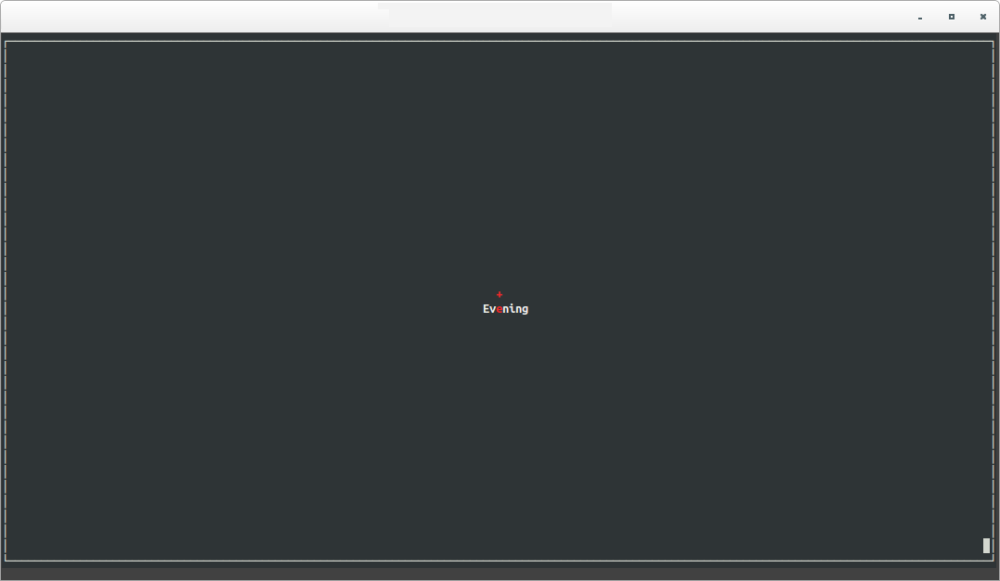
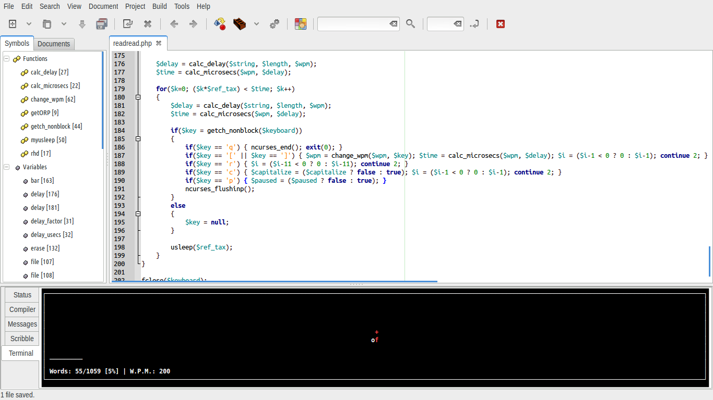

# READREAD

A Rapid Serial Visual Presentation PHP script, using ncurses, for quick reading.



Being developed using Geany



## Installing depedencies on an Ubuntu 14.04:

In order to run the script you need:

* PHP5-CLI (Command Line Interface)
* PHP NCurses Extension (Library for creating windows via CLI)

For installing PHP CLI and building the extension, follow these steps (Ubuntu 14.04)

```bash
sudo apt-get install php5-cli php5-dev libncursesw5-dev ncurses-dev

sudo pecl install ncurses
```
Add at the end of `/etc/php5/cli/php.ini`

```php
extension=ncurses.so
```
**IF THE METHOD ABOVE FAILS**, then maybe you can build and install the extension manually, this way

```bash
mkdir php-ncurses
cd php-ncurses
pecl download ncurses #ignore the error
tar zxvf ncurses-1.0.2.tgz
cd ncurses-1.0.2/
./configure
make
sudo make install
```

**AND** if you still didn't make it in the step before, add to your `/etc/php5/cli/php.ini`

```php
extension=ncurses.so
```

## Running the script

```bash
chmod +x readread.php # make sure file is executable
cat tea.txt | ./readread.php --words-per-minute 250
```
## Options

```
	./readread.php

		-w,	--words-per-minute	<number>
		Number of words that it shows per minute, approx.

		-b,	--opaque
		If set, background will be opaque, and not show terminal transparency

		-c,	--capitalize
		Transform words to uppercase

		-f,	--file	<file>
		Reads text from file, instead of from STDIN (standard input)

```
