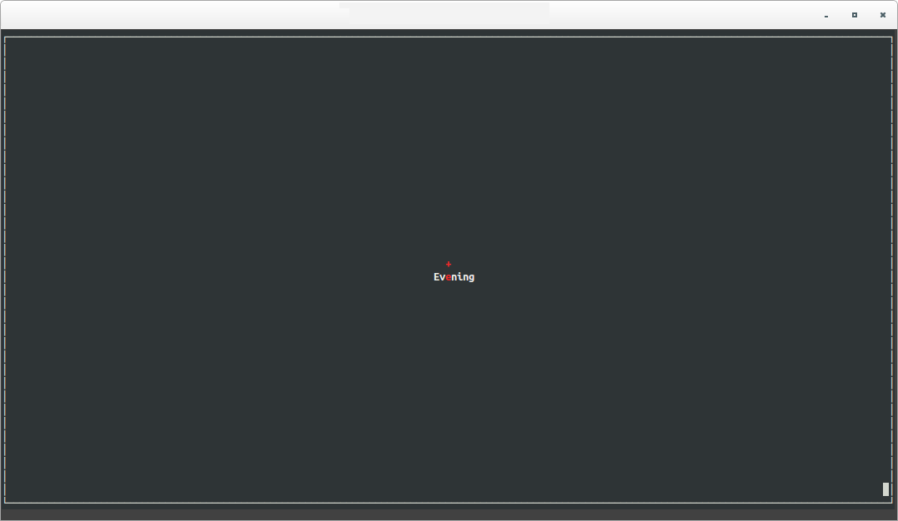
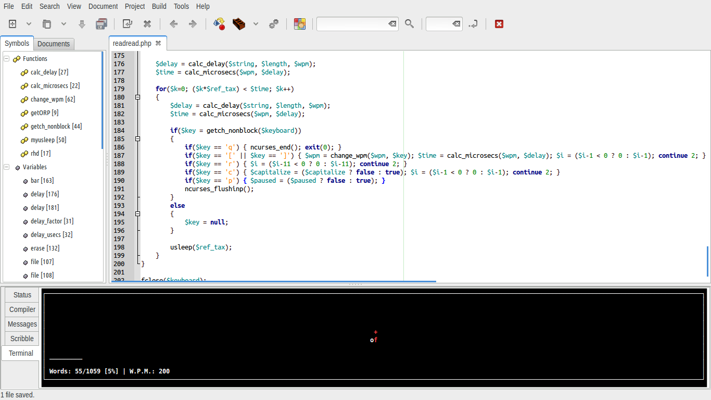
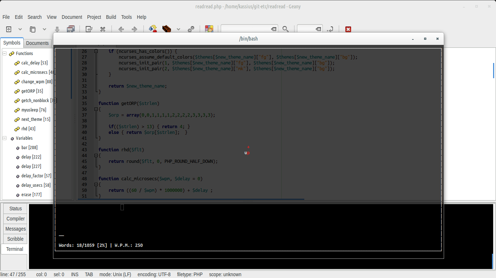
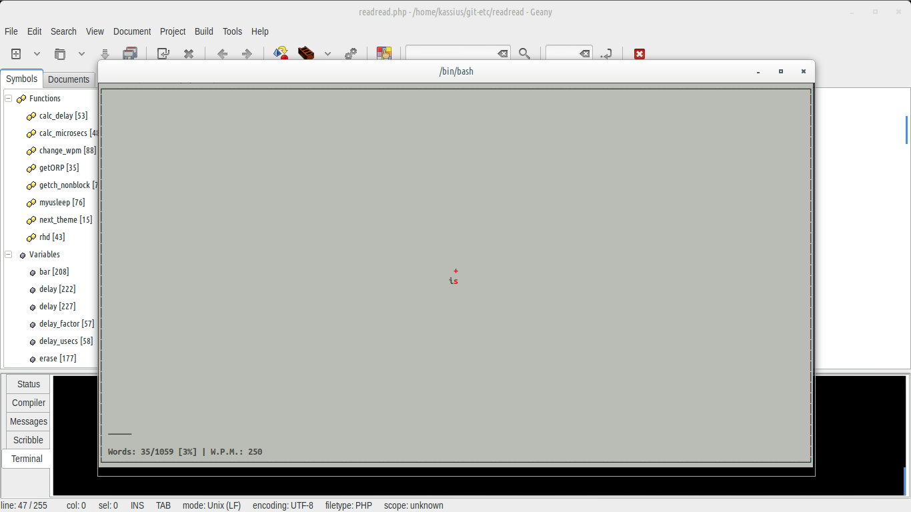
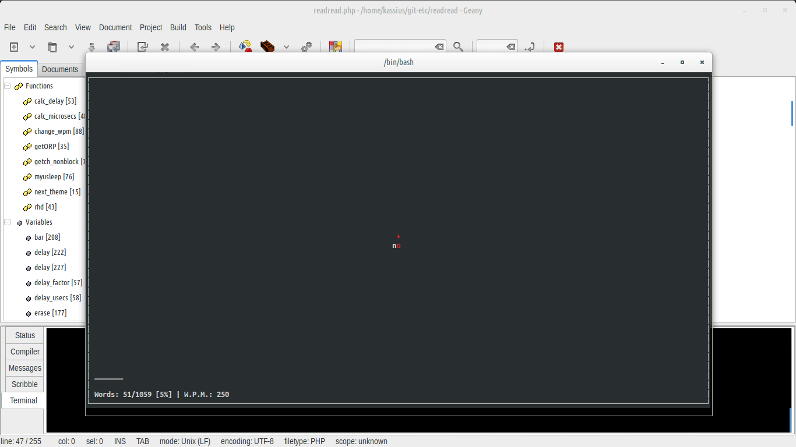

# READREAD

A Rapid Serial Visual Presentation script written in PHP using ncurses, for quick reading.



## Features

* Run from terminal
* Can read from file or stdin (pipe)
* Themes - see screenshots
* Progress bar and progress count
* Fits to terminal as it uses ncurses library
* Speed of text can be controlled either by command line or keyboard on the fly (keys **[** and **[**)
* Rewind text (key **r**)
* Change case of text to upper case or lower case (key **c**)
* Start from position (word number n. *--position <n>*)
* Status bar text can be easily customizable.
* Change ORP marker character (*--marker <char>*) from default '+'

Being developed using Geany - running from Geany's embedded terminal



### Themes

#### Theme 'default' - allow transparency



#### Theme 'light'



#### Theme 'opaque'



## Installing depedencies on an Ubuntu 14.04:

In order to run the script you need:

* PHP5-CLI (Command Line Interface)
* PHP NCurses Extension (Library for creating windows via CLI)

For installing PHP CLI and building the extension, follow these steps (Ubuntu 14.04)

```bash
sudo apt-get install php5-cli php5-dev libncursesw5-dev ncurses-dev

sudo pecl install ncurses
```
Add at the end of `/etc/php5/cli/php.ini`

```php
extension=ncurses.so
```
**IF THE METHOD ABOVE FAILS**, then maybe you can build and install the extension manually, this way

```bash
mkdir php-ncurses
cd php-ncurses
pecl download ncurses #ignore the error
tar zxvf ncurses-1.0.2.tgz
cd ncurses-1.0.2/
./configure
make
sudo make install
```

**AND** if you still didn't make it in the step before, add to your `/etc/php5/cli/php.ini`

```php
extension=ncurses.so
```

## Running the script

```bash
chmod +x readread.php # make sure file is executable
cat tea.txt | ./readread.php --words-per-minute 250
```
## Options

### Command line options

```
	./readread.php

		-w,	--words-per-minute	<number>
		Number of words that it shows per minute, approx.

		-t,	--theme		<theme>
		Use to choose the theme! current themes are: default, light and opaque.

		-c,	--capitalize
		Transform words to uppercase (toggle 'c' key)

		-f,	--file	<file>
		Reads text from file, instead of from STDIN (standard input)
		
        -s,	--status
        Status and progress bar disabled by default. (toggle with 's' key)
        
        -p,	--position <word no. #>
        Start reading from word number #.
        
        -m, --marker
        Changes marker character from default '+'

        -h, --help
        Show help and exit
```

### Keyboard shortcuts

```
	These are the keyboard shortcuts currently avaliable.

	'[' and ']'
		Change how many words per minute are running.

	c
		Toggle between upper case / lower case.

	r
		Rewind the text by ~ 10 words.

	t
		Change theme to the next avaliable.

	p
		Toggle between play / pause.

	s
		Toggle status bar on/off

	q
		Quit.
```

## Example usage

Make the file executable if it is not yet:

```bash
chmod +x readread.php # make sure file is executable
```

### Running the script directly

    ./readread.php -f tea.txt

or

    ./readread.php --file tea.txt

### Running via pipe

    cat tea.txt | ./readread.php

or

    ./readread.php < tea.txt

